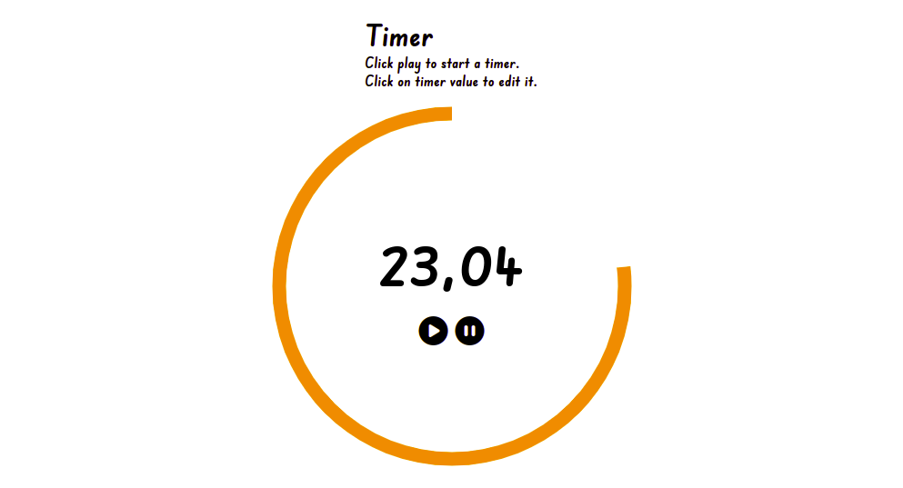

# Timer

A timer with animations.

## Features

- displays a timer
- allows user to change timer value
- draws an animated border around the timer

## Technologies used

- HTML
- CSS
- JavaScript
- SVG

## Credits:

- Google Fonts - [Edu SA Beginner](https://fonts.google.com/specimen/Edu+SA+Beginner)
- FontAwesome icons:

_[circle-play](https://fontawesome.com/icons/circle-play?s=solid)
_[circle-pause](https://fontawesome.com/icons/circle-pause?s=solid)

## Preview

Live demo: [click here](https://pawelpohland.github.io/timer/)

